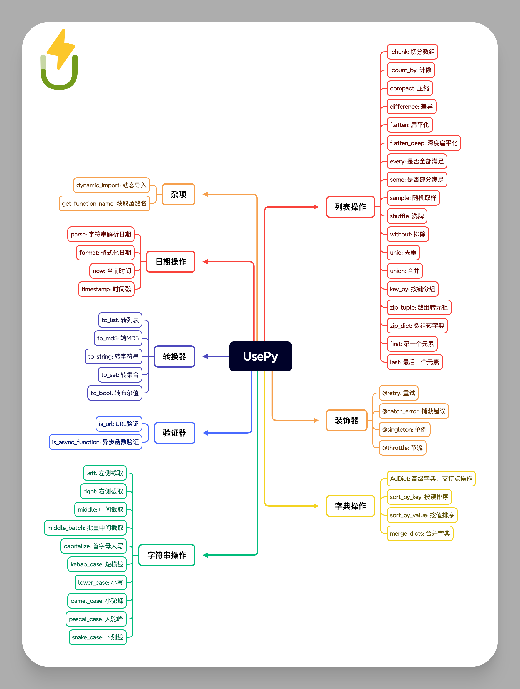

<div align=center>


`usepy`是一个简单易用的Python工具库，包含了一些常用的工具函数。

<a href="https://github.com/mic1on/usepy/actions/workflows/test.yml?query=event%3Apush+branch%3Amain" target="_blank">
    
</a>
<a href="https://pepy.tech/badge/usepy">
</a>
<a href="https://pypi.org/project/usepy" target="_blank">
    
</a>

<a href="https://pypi.org/project/usepy" target="_blank">
    
</a>
</div>

### 安装

```bash
pip install usepy -U
```



更多参阅[官方文档](https://usepy.code05.com/)

## 贡献

欢迎提交PR，一起完善这个工具库。
